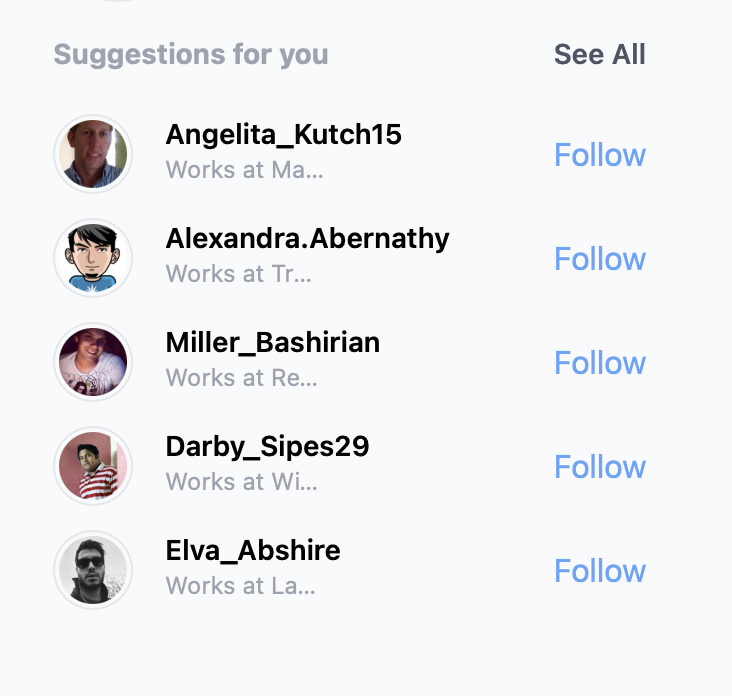

# 100 days of code, day 20

## Tailwind CSS with Next.js + faker.js

Tailwind is a utility first CSS framework that simplifies css to build any design, directly in your markup.

Today we are going to populate a list with `faker.js` and style it with `Tailwindcss` all in Next.js (a React.js framework)

_Creating a new project in your terminal/cmd_

```bash
npx create-next-app -e with-tailwindcss my-project
# then
cd my-project
# thereafter
npm i faker
```

More examples [Here](https://tailwindcss.com/docs/guides/nextjs)

In `pages/index.js` the following code will produce this respectively

```jsx
import { useEffect, useState } from "react";
import faker from "faker";

export default function Home() {
  const [suggestions, setSuggestions] = useState();
  useEffect(() => {
    const suggestion = [...Array(5)].map((_, i) => ({
      ...faker.helpers.contextualCard(),
      id: i,
    }));

    setSuggestions(suggestion);
  }, []);
  return (
    <div className="mt-4 ml-10">
      <div className="flex justify-between text-sm mb-5">
        <h3 className="text-sm font-bold text-gray-400">Suggestions for you</h3>
        <button className="text-gray-600 font-semibold">See All</button>
      </div>

      {suggestions?.map((profile) => (
        <div key={profile.id} className="flex item-center justify-between mt-3">
          
          <div className="flex-1 ml-4">
            <h2 className="font-semibold text-sm">{profile.username}</h2>
            <h3 className="text-xs text-gray-400 truncate w-20">
              Works at {profile.company.name}
            </h3>
          </div>
          <button className="text-blue-400">Follow</button>
        </div>
      ))}
    </div>
  );
}
```

## Results



## Tag

Next.js | faker.js | Tailwind CSS | useState() | useEffect | [IG Web App](https://ig-web-v2.vercel.app)
